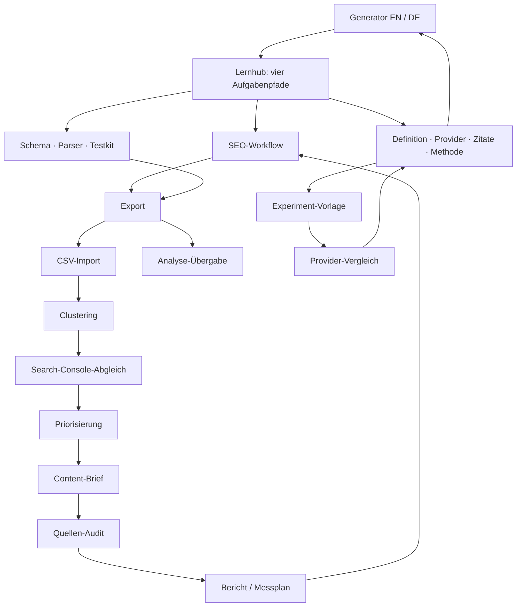

# AI Fanout: Longtail-Masterplan für 30 Themenpakete

**Stand: 10. Oktober 2026. Status: alle 30 Themenpakete / 60 EN-DE Arbeitspakete umgesetzt und live geprüft; Abschluss in SEO_LONGTAIL_COMPLETION_AUDIT_2026-10-10.md. Fortschritt in SEO_LONGTAIL_PROGRESS.json. Die untenstehenden Ausgangsbefunde sind die datierte Planungsbasis, keine behaupteten Post-Release-Rankings.**

## Ziel und Umfang

**Vom Eigentümer geänderter Umfang am 10. Oktober 2026:** „Nein, ich habe noch kein Excel. Lass das einfach mit Excel. Mach einfach weiter.“ Paket 23 wird deshalb mit dem tatsächlich geprüften Google-Sheets-Import umgesetzt. Excel-Anleitung und Excel-Importtest entfallen ausdrücklich. Die 30 Themenpakete / 60 EN-DE Arbeitspakete und das vollständige Release-Ziel bleiben erhalten.

AI Fanout soll die verlässlichste praktische Anlaufstelle für das Erzeugen, Lesen und Weiterverarbeiten von Query-Fanout-Ergebnissen werden. Das wirtschaftliche Ziel sind passende Suchbesucher, die das Tool nutzen und mit einem verwertbaren Ergebnis weiterarbeiten. Ein Ranking für jede Wortvariante ist kein sinnvoller Erfolgsmaßstab; dauerhaft gute Rankings können wir nicht garantieren.

Der Plan enthält **30 eigenständige Themenpakete mit 60 URL-Arbeitspaketen**:

- **13 bestehende Themenpaare wesentlich überarbeiten:** 26 vorhandene URLs.
- **17 neue Themenpaare entwickeln:** 34 vorgeschlagene neue URLs.
- Englisch und Deutsch sind zwei Ausgaben derselben Leseraufgabe, keine zwei unabhängigen Themen.
- Die Website hatte zu Planbeginn **39 kanonische indexierbare URLs**. Werden alle 17 neuen Paare nach Qualitätsprüfung separat umgesetzt, wächst sie auf **73 URLs**. Das ist eine Planobergrenze, kein Ziel um seiner selbst willen.
- 13 weitere bestehende URLs behalten ihre Aufgabe: fünf Beispielpaare und drei Rechts-/Transparenzseiten. Ihre Fakten und Links bleiben Teil der Qualitätskontrolle, werden aber nicht als zusätzliche Neuproduktion gezählt.

Der vollständige operative Backlog liegt in [SEO_LONGTAIL_PAGE_BACKLOG_2026-10-10.csv](SEO_LONGTAIL_PAGE_BACKLOG_2026-10-10.csv). Er enthält eine Zeile je URL, Ziel-Keyword, Leseraufgabe, Originalleistung, Evidenz, Abhängigkeit, Überschneidungsgrenze und Messziel.

**Empfehlung:** einen großen redaktionellen Produktionsbatch planen und in drei überprüfbaren Wellen veröffentlichen. Die erste Welle bearbeitet 38 URLs. Neue Artikel müssen nutzbare Vorlagen, geprüften Code oder eigene nachvollziehbare Beispiele liefern. Eine zusätzliche URL mit bloßen Wortvarianten schafft keine eigenständige Aufgabe. Google empfiehlt hilfreiche Originalinhalte und nachvollziehbare Strukturen auch für KI-Suche; daraus folgt keine Pflicht zu einer Seite pro Fanout-Variante. [Google: AI-search optimization](https://developers.google.com/search/docs/fundamentals/ai-optimization-guide)

## Was wir heute wissen

| Evidenzklasse | Befund und Zeitpunkt | Konsequenz |
| --- | --- | --- |
| V1 – heute geprüfter Bestand | 39 kanonische URLs; bestehende Tool-, Export-, History- und Übergabe-Verträge. Letzter Live-Release: Commit 173f6e2. | Darauf bauen; keine neue Produktfähigkeit durch SEO-Text behaupten. |
| H1 – historische authentifizierte GSC-Beobachtung | 23. September–6. Oktober: 232 Impressionen / 0 Klicks; vorheriger Vergleichszeitraum 9.–22. September: 68 / 1. | Sichtbarkeit hat in diesem Fenster zugenommen, Klickgewinn ist noch nicht nachgewiesen. |
| H1 – historischer Generator-Cluster | query fan out generator: 87 Impressionen, Ø Position 9; query fanout generator: 86, Ø 15. Zusammen 173 der 232 Impressionen, auf englischer Homepage / US bestätigt. | Stärkste belegte Ausgangschance; Homepage besitzt diesen Intent. |
| H1 – ergänzende historische Suchanfrage | query fan out tool: 14 Impressionen, Ø Position 29,3; zugehörige Landingpage nicht verifiziert. | Relevante Variante untersuchen; keine vermeintliche Erfolgsseite daraus ableiten. |
| H1 – deutsche Sichtbarkeit | 34 Impressionen, Ø Position 93 im damaligen Fenster. | Deutsch bleibt strategische Sprachversion; positive Ranking-Entwicklung nicht nachgewiesen. |
| H1 – historischer Indexbericht | Bericht vom 4. Oktober: 5 von damals 35 URLs indexiert, 30 entdeckt / nicht indexiert. | Aktuellen Bericht und URL-Prüfungen neu erfassen. Dies ist **keine** heutige Aussage „5 von 39“. |
| H2 – gespeicherte Keyword-Daten | Heute exakt den ai-fanout.com-Workspace ws_g1h1padb4chj gewählt; alle 47 gespeicherten Keywords gelesen. Beobachtungen überwiegend vom 29. August. | Begriffsfamilien nutzbar; Kennzahlen veraltet, aktuelle Positionen nicht bewiesen. |
| H2/H3 – früherer Research-Lauf | Englischer Lauf krr_pl8hkpprbj7v vom 9. Oktober: 363 Kandidaten. Generator-Autocomplete mit Provider-Schätzung Volumen 30 / Difficulty 6; Prompt als generierte Idee, JSON als Autocomplete ohne Kennzahlen. | Schätzung ist kein Google-Messwert und keine Ranking-Wahrscheinlichkeit. Ideen sind Nachfragehypothesen. |
| P1 – aktuelle technische Primärquellen | Google Search, GSC, OpenAI-Websuche und Gemini Interactions am 10. Oktober recherchiert. | Fakten und Tutorials gegen echte Verträge prüfen; Quellen stützen Fähigkeiten, nicht Keyword-Volumen. |
| P2 – aktuelle Hersteller-Anwendungsdokumentation | Ahrefs zeigt Query-Einsicht, Profound beschreibt eine Schätzung und Brief-/Cluster-Anwendungen; öffentliche Export-/Workflow-Dokumentation existiert. | Eigenständige Aufgaben und unterschiedliche Tool-Klassen sind plausibel. Herstellertexte beweisen weder deren Ranking noch unsere Nachfrage. |
| H3 – neue Longtail-Ziele | Die meisten neuen Workflow-, Branchen- und API-Zielphrasen sind noch nicht quantitativ validiert. | Als Experimente priorisieren; keine erfundenen Volumina, Wettbewerbswerte oder Traffic-Prognosen. |

In diesem Planungsschritt wurden gespeicherte Daten gelesen; es wurde **kein neuer kostenpflichtiger Research- oder Provider-Ausgabelauf** gestartet. Der CSV-Backlog ist eine lokale Planungsliste, keine angeblich erfolgreich befüllte Crawl-Foundry-Keywordliste. Unpassende SQL-, Netzwerk- und andere „fanout“-Treffer gehören nicht in diese Strategie.

**Beweisgrenzen:** Der GSC-Snapshot ist historisch. Der aktuelle Indexstatus, ein Effekt der jüngsten Releases, die Nachfrage sämtlicher neuer Longtails und künftige Rankings sind **NOT PROVEN**. Durchschnittspositionen sind keine stabilen täglichen Einzelrankings.

## Langzeitziele: 3, 6 und 12 Monate

| Horizont | Konkretes Arbeitsziel | Erfolgskriterium |
| --- | --- | --- |
| Erste 30 Tage | Neue GSC-/Index-Baseline, Generator-Einstieg und Lernpfade schärfen; Welle A mit sechs originären neuen Vorlagen-/Workflow-Paaren produzieren. | 38 geplante URL-Arbeitspakete in überprüfbaren Releases; alle veröffentlichten URLs technisch indexierbar, richtige Canonicals / hreflang / interne Ziele; echte Originalleistungen. Indexierung selbst bleibt Googles Entscheidung. |
| 60–90 Tage | Mess-/Quellen-Arbeitsabläufe und Developer-Grundlage liefern; Welle B abschließen; Welle C nach Quellen-, Nachfrage- und Nutzentest beginnen. | 25 Themenpakete bearbeitet, sofern alle separat gerechtfertigt; 51 mögliche kanonische URLs nach Welle A und 63 nach B; erste vergleichbare Kohortenberichte und nutzbare Code-/Vorlagen-Artefakte. |
| 6 Monate | Wiederkehrende qualifizierte Suchklicks in mindestens vier unabhängigen Aufgabenclustern gewinnen. | Vorgeschlagenes Managementziel: mindestens fünf validierte, passende Longtails mit wiederkehrender Top-10-Sichtbarkeit; zusätzlich Tool-Nutzung / Export / Übergabe prüfen. Ein Ziel, keine Prognose. |
| 12 Monate | Eine gepflegte Referenz für native Fanout-Beobachtung, redaktionelle Weiterverarbeitung und API-Implementierung etablieren. | Vorgeschlagenes Managementziel: 10–15 passende Longtails mit wiederkehrender Top-10-Sichtbarkeit über mindestens fünf Aufgabencluster; anhaltende qualifizierte Klicks und nachweislich genutzte Originalartefakte. Keine Zielerreichung durch eigene Brand-Varianten oder Übersetzungszählung vortäuschen. |

„Validiert“ bedeutet hier: Suchanfragen passen zur Leseraufgabe und treten wiederkehrend auf; die angebotene Anleitung funktioniert; Rankings und Klicks werden im passenden Land / Device / Zeitraum beobachtet. Ein Herstellertext oder ein einzelner Fanout-Lauf ersetzt das nicht. Es gibt mangels belastbarer Click-/Conversion-Baseline keine seriöse monatliche Traffic- oder Umsatzprognose.

Englisch beginnt mit der belegten Generator-Chance. Deutsche Ausgaben werden sprachlich und fachlich eigenständig geprüft; fehlende Nachfragewerte werden nicht von englischen Keywords übernommen. Unterschiedliche Sprache allein rechtfertigt keine abweichende Produktwahrheit.

## Seitenarchitektur und Verantwortung

Die vorhandenen Routen bleiben erhalten. Neue Anleitungen liegen unter /library/… und /de/lernen/…. Der Lernhub ordnet vier Leserwege: **Verstehen → Ausführen → Auswerten → Implementieren**. Dafür sind keine weiteren dünnen Übersichts-URLs nötig.

- **AI Fanout:** kurze Inputs, native API-beobachtete Queries beziehungsweise klar bezeichnete modellierte Search Ideas, deren Interpretation und Weiterverarbeitung.
- **SEO Fanout:** vorhandene weiterführende Analyseübergabe mit nachvollziehbarem Auswahl-Scope; kein zusätzliches Provider-Ergebnis durch die Übergabe erfinden.
- **Crawl Foundry:** umfassendere SEO-/Workspace-Workflows. Eine AI-Fanout-Anleitung soll weiterhin selbständig nützlich sein, auch ohne Wechsel zu diesem Produkt.
- Alle drei gehören demselben Eigentümer. Verweise sind transparent und gelten nicht als unabhängige Bestätigung.

### Clustergraph

Jede neue Seite erhält mindestens einen echten Einstieg vom passenden Lernpfad und einen sachlich passenden Verweis aus einer bestehenden Anleitung. Entscheidend ist der nachvollziehbare Leserweg. Kontextlinks erklären die nächste Handlung; nicht jeder Artikel verweist pauschal auf alle übrigen. Links, Canonicals, hreflang und Navigation zeigen nur auf veröffentlichte, erfolgreiche Ziele.

## Die 30 Themenpakete

Die folgenden Keywords sind **Zielphrasen**. Sie sind keine behauptete vollständige Nachfrageanalyse. V1/H1/H2/H3/P1/P2 beziehen sich auf das Evidenzregister oben. Alle Routen unter „Neu vorgeschlagen“ sind Kandidaten und derzeit nicht als live ausgewiesen.

### 01. Generator und Einstieg

- **Aktion / Priorität / Welle:** Überarbeiten; P0; A. Cluster: Tool und Orientierung.
- **URLs:** EN `/` ↔ DE `/de`.
- **Primäre Zielphrasen:** EN „query fan out generator“; DE „Query Fanout Generator“. Ergänzend: query fanout generator; query fan out tool; AI Fanout Tool.
- **Leseraufgabe:** In einem Lauf zwischen nativen API-Queries und modellierten Search Ideas wählen und ein brauchbares Ergebnis erhalten.
- **Eigenleistung:** Einstieg anhand zweier klar beschrifteter Ausgabebeispiele; Entscheidungshilfe nach Nutzeraufgabe; sichtbare Grenzen und nachvollziehbarer Weg zu Auswahl, Export und Auswertung.
- **Evidenz:** H1: englische Generator-Varianten mit 173 historischen GSC-Impressionen; deutsche Nachfrage unbestätigt.
- **Abhängigkeit vor Veröffentlichung:** Aktuelle UI, Kosten- und Modusgrenzen gegen Implementierung prüfen; verständliche lokale Bedienung vor Release.
- **Abgrenzung:** Generator-Synonyme bleiben auf einer Homepage je Sprache; keine konkurrierende Free-Tool-Landingpage.
- **Leserweg:** Definition, Prompt, Export; primäre Conversion: qualifizierter Tool-Start.
- **Messung:** Generator-Query-Kohorte: Klicks, CTR und qualifizierte Starts; EN/DE getrennt.

### 02. Lernhub als Aufgaben-Navigation

- **Aktion / Priorität / Welle:** Überarbeiten; P0; A. Cluster: Tool und Orientierung.
- **URLs:** EN `/library` ↔ DE `/de/lernen`.
- **Primäre Zielphrasen:** EN „query fanout guide“; DE „Query Fanout Anleitung“. Ergänzend: AI search query guides; Query Fanout lernen.
- **Leseraufgabe:** Die richtige Anleitung für Verstehen, Ausführen, Auswerten oder Implementieren finden.
- **Eigenleistung:** Vier nachvollziehbare Lernpfade mit Einstieg, benötigtem Material und nächstem Ergebnis; neue Vorlagen und API-Anleitungen als eigene Aufgaben auffindbar machen.
- **Evidenz:** V1: vorhandene Bibliothek und wachsende Anzahl konkreter Arbeitsabläufe; H3: Suchnachfrage des Hubs offen.
- **Abhängigkeit vor Veröffentlichung:** Alle 30 Themenpakete in Navigation und Registry zuordnen; nur veröffentlichte Ziele verlinken.
- **Abgrenzung:** Hub fasst Aufgaben zusammen; übernimmt keine vollständigen Definitionen oder Tutorials.
- **Leserweg:** Home → Lernpfad → Anleitung → Tool beziehungsweise nächste Aufgabe.
- **Messung:** Erreichbarkeit aller Seiten, keine Orphans; Hub-zu-Anleitung-Nutzung.

### 03. Methode und Beweisgrenzen

- **Aktion / Priorität / Welle:** Überarbeiten; P0; A. Cluster: Tool und Orientierung.
- **URLs:** EN `/methodology` ↔ DE `/de/methode`.
- **Primäre Zielphrasen:** EN „query fanout methodology“; DE „Query Fanout Methode“. Ergänzend: native vs modeled fanout; AI fanout limitations.
- **Leseraufgabe:** Verstehen, was die Ergebnisse tatsächlich zeigen, was fehlt und wie ein Lauf überprüft wird.
- **Eigenleistung:** Quelle→Ausgabetyp→zulässige Schlussfolgerung-Matrix; datierte Provider-/Parser-Referenzen; dokumentierte Kosten, Aufbewahrung und Einschränkungen.
- **Evidenz:** V1/P1: aktuelle Produktverträge und offizielle Provider-Dokumentation; H3: Keyword-Nachfrage offen.
- **Abhängigkeit vor Veröffentlichung:** API-Versionen und reale Verträge prüfen; alte Planner-Verträge nicht als native Schemas übernehmen.
- **Abgrenzung:** Zentrale Vertrauensgrundlage; wiederholte Experimente und technische Parser erhalten eigene Handlungsanleitungen.
- **Leserweg:** Alle Provider-Guides und Vorlagen → Methode; Methode → Beispiel und Experiment-Vorlage.
- **Messung:** Korrekte und aktuelle Aussagen; Nutzung von Quellen/Methode; keine versteckten-Trace-Claims.

### 04. Query Fanout verstehen

- **Aktion / Priorität / Welle:** Überarbeiten; P1; A. Cluster: Grundlagen und Interpretation.
- **URLs:** EN `/library/what-is-ai-query-fanout` ↔ DE `/de/lernen/was-ist-ai-query-fanout`.
- **Primäre Zielphrasen:** EN „what is query fan out in AI search“; DE „Was ist Query Fanout“. Ergänzend: AI search query fanout; query expansion vs fanout; LLM query fanout.
- **Leseraufgabe:** Fanout, Umschreiben und Begriffserweiterung unterscheiden und die Grenzen von Beispielen verstehen.
- **Eigenleistung:** Eigene beschriftete Prozessgrafik und ein durchgehendes redaktionelles Beispiel; Begriffe gegen aktuelle Primärquellen abgrenzen.
- **Evidenz:** H2: gespeicherte Keyword-Familie, Datenstand August; P1: Google/OpenAI; keine aktuelle Positionsmessung.
- **Abhängigkeit vor Veröffentlichung:** Ein Beispiel ausdrücklich als redaktionell markieren; bestehende gute Passagen beibehalten.
- **Abgrenzung:** Google AI Mode als Definitionsabschnitt; keine zusätzliche vermeintliche AI-Mode-Trace-Tool-Seite.
- **Leserweg:** Generator, Methode, Prompt und SEO-Arbeitsablauf.
- **Messung:** Relevante Definitions-Queries und Klicks; Übergang zum passenden Modus.

### 05. OpenAI-Queries sehen und einordnen

- **Aktion / Priorität / Welle:** Überarbeiten; P1; A. Cluster: Grundlagen und Interpretation.
- **URLs:** EN `/library/how-to-see-openai-search-queries` ↔ DE `/de/lernen/openai-suchanfragen-sehen`.
- **Primäre Zielphrasen:** EN „how to see OpenAI search queries“; DE „OpenAI Suchanfragen sehen“. Ergänzend: ChatGPT search queries; OpenAI web search queries.
- **Leseraufgabe:** Ein sichtbares API-Suchergebnis korrekt lesen und fehlende Query-Felder diagnostizieren.
- **Eigenleistung:** Annotierter, bereits freigegebener OpenAI-Beleg mit Feldzuordnung und Entscheidungspfad für Suchaufruf ohne sichtbare Queries; Datum und API-Kontext zeigen.
- **Evidenz:** H2: gespeicherte ChatGPT/OpenAI-Query-Familie; V1/P1: vorhandene datierte Fixtures und OpenAI-Dokumentation.
- **Abhängigkeit vor Veröffentlichung:** Nur freigegebene ältere Beobachtungen verwenden; bestehende diagnostische Tabelle ergänzen, nicht erneut kosmetisch bauen.
- **Abgrenzung:** Lesen/Benutzen hier; eigener Parser-Code in Paket 27. API-Ausgabe nicht mit Consumer-ChatGPT-Innenleben gleichsetzen.
- **Leserweg:** Methode, Export, Parser, Vergleich.
- **Messung:** Provider-Query-Kohorte, erfolgreiche nächste Aufgabe; keine Vollständigkeitsbehauptung.

### 06. Gemini-Queries sehen und einordnen

- **Aktion / Priorität / Welle:** Überarbeiten; P1; A. Cluster: Grundlagen und Interpretation.
- **URLs:** EN `/library/gemini-search-queries` ↔ DE `/de/lernen/gemini-suchanfragen`.
- **Primäre Zielphrasen:** EN „see Gemini search queries“; DE „Gemini Suchanfragen sehen“. Ergänzend: Gemini queries; Gemini query fanout; Gemini search grounding.
- **Leseraufgabe:** Verstehen, welche Query- und Quelleninformationen der verwendete API-Vertrag liefert.
- **Eigenleistung:** Aktuelle, vertragsbezogene Feld-/Grenzenübersicht; ausdrücklich beschriftetes synthetisches Beispiel statt unfreigegebener Grounding-Ausgabe.
- **Evidenz:** H2: gespeicherte Gemini-Familie; P1: Interactions-Dokumentation; neue reale Ausgabe nicht veröffentlicht.
- **Abhängigkeit vor Veröffentlichung:** Interactions-Vertrag vor Schreiben detailliert prüfen; GenerateContent-Metadaten nicht ungeprüft übertragen.
- **Abgrenzung:** Benutzung und Interpretation hier; Entwickler-Implementierung in Paket 28.
- **Leserweg:** Methode, Quellen-Guide, Vergleich, Gemini-Parser.
- **Messung:** Gemini-Query-Kohorte; korrekte API- und Speichergrenzen.

### 07. KI-Zitate und Quellen interpretieren

- **Aktion / Priorität / Welle:** Überarbeiten; P1; A. Cluster: Grundlagen und Interpretation.
- **URLs:** EN `/library/ai-citations` ↔ DE `/de/lernen/ki-zitate-und-quellen`.
- **Primäre Zielphrasen:** EN „AI search citations“; DE „KI Zitate und Quellen“. Ergänzend: ChatGPT citations; Gemini citations; KI Quellen sehen.
- **Leseraufgabe:** Suchquelle, zitierte Quelle und einen tatsächlich gestützten Satz unterscheiden.
- **Eigenleistung:** Eine überprüfbare Claim-/Zitat-/Quellen-Annotierung anhand erlaubten Materials; zeigen, welche Aussage ein Link stützt und welche offenbleibt.
- **Evidenz:** H2: gespeicherte Citation-Begriffe; P1/V1: Provider-Dokumentation und zulässige bestehende Belege.
- **Abhängigkeit vor Veröffentlichung:** Quellenauflösung, Datum, Nutzungsrechte und eigener Common-Owner-Hinweis prüfen.
- **Abgrenzung:** Bedeutung von Zitaten hier; systematischer Quellen-Prüfprozess mit Arbeitsblatt in Paket 19.
- **Leserweg:** Quellen-Audit, Methode, bestehendes Quellen-Beispiel.
- **Messung:** Citation-Query-Kohorte; Nutzung des Prüfpfads; keine Citation-Garantie.

### 08. Fanout für SEO anwenden

- **Aktion / Priorität / Welle:** Überarbeiten; P1; A. Cluster: SEO-Arbeitsabläufe.
- **URLs:** EN `/library/ai-query-fanout-for-seo` ↔ DE `/de/lernen/query-fanout-fuer-seo`.
- **Primäre Zielphrasen:** EN „query fanout for SEO“; DE „Query Fanout für SEO“. Ergänzend: AI search content gaps; Fanout Content Strategie.
- **Leseraufgabe:** Aus beobachteten oder modellierten Fragen einen überprüfbaren Content-Arbeitsablauf ableiten.
- **Eigenleistung:** Durchgehender Workflow von Query-Auswahl über Cluster und GSC-Prüfung bis Brief und Messung; ein eigenes ausgefülltes Beispiel mit klaren Datenklassen.
- **Evidenz:** H2: gespeicherte SEO-/Content-Gap-Familie; H3: einzelne Workflow-Longtails noch nicht gemessen.
- **Abhängigkeit vor Veröffentlichung:** Vorlagen 14–18 verfügbar beziehungsweise abschnittsweise real nutzbar; Beispiel ohne erfundene Kunden-Ergebnisse.
- **Abgrenzung:** Übersichts-Workflow statt konkurrierender Detail-Tutorials; alte Content-Gap-Weiterleitung erhalten.
- **Leserweg:** Cluster, Priorisierung, Brief, GSC-Abgleich, Messung.
- **Messung:** Workflow-Query-Kohorte, Brief-/Export-Nutzung; keine automatische Content-Gap-Wahrheit.

### 09. SEO für KI-Suche

- **Aktion / Priorität / Welle:** Überarbeiten; P1; A. Cluster: SEO-Arbeitsabläufe.
- **URLs:** EN `/library/seo-for-ai-search` ↔ DE `/de/lernen/seo-fuer-ki-suche`.
- **Primäre Zielphrasen:** EN „SEO for AI search“; DE „SEO für KI Suche“. Ergänzend: AI search SEO; Inhalte für KI Suche optimieren.
- **Leseraufgabe:** Technische Auffindbarkeit und belegbare Inhaltsverbesserung priorisieren.
- **Eigenleistung:** Prüfbare Checkliste mit Indexierbarkeit, internen Links, eindeutiger Leseraufgabe und Primärbelegen; Google-Empfehlungen von Produktbeobachtungen trennen.
- **Evidenz:** H2: gespeicherte Keyword-Familie; P1: aktuelle Google-AI-Suche-Dokumentation. Breite Suchbegriffe konkurrenzstark.
- **Abhängigkeit vor Veröffentlichung:** Keine zusätzlichen Spezial-Schemas oder versteckten Fanout-Faktoren versprechen; echte Prüfbeispiele verwenden.
- **Abgrenzung:** Breiter Orientierungs-Guide bleibt eine Seite; Spezialseiten lösen operative Teilaufgaben.
- **Leserweg:** SEO-Workflow, GSC-Abgleich, Quellen-Audit und Methode.
- **Messung:** Qualifizierte Longtail-Klicks und Übergang zum Workflow; Headterm-Ranking kein Release-Kriterium.

### 10. Warum Ergebnisse schwanken

- **Aktion / Priorität / Welle:** Überarbeiten; P1; A. Cluster: Grundlagen und Interpretation.
- **URLs:** EN `/library/why-ai-fanout-results-change` ↔ DE `/de/lernen/warum-fanout-ergebnisse-schwanken`.
- **Primäre Zielphrasen:** EN „why query fanout results change“; DE „Warum ändern sich Fanout Ergebnisse“. Ergänzend: same prompt different queries; country language AI search.
- **Leseraufgabe:** Beobachtete Schwankungen von vermuteten Ursachen und methodischen Fehlern unterscheiden.
- **Eigenleistung:** Faktoren-/Kontrollen-Matrix mit einer datierten vorhandenen Beobachtung; dokumentieren, welche Ursache im Beispiel nicht isoliert wurde.
- **Evidenz:** V1: erlaubte vorhandene Beobachtungen; H3: aktuelle Suchnachfrage offen.
- **Abhängigkeit vor Veröffentlichung:** Keine neuen Benchmarks behaupten; Datum, Modell und Locale aus vorhandener Quelle erhalten.
- **Abgrenzung:** Erklärung hier; nutzbare Wiederholungs-/Versuchsvorlage in Paket 25. Länder-Sprach-Redirect erhalten.
- **Leserweg:** Bestehendes Schwankungs-Beispiel, Experiment-Vorlage, Vergleich.
- **Messung:** Relevante Diagnose-Queries; richtige Wahl kontrollierter Folgeaufgaben.

### 11. Modelle und Suchausgaben fair vergleichen

- **Aktion / Priorität / Welle:** Überarbeiten; P1; A. Cluster: Grundlagen und Interpretation.
- **URLs:** EN `/library/compare-ai-model-searches` ↔ DE `/de/lernen/ki-modelle-vergleichen`.
- **Primäre Zielphrasen:** EN „compare AI model search queries“; DE „KI Suchmodelle vergleichen“. Ergänzend: OpenAI vs Gemini search queries; no fanout query visible.
- **Leseraufgabe:** Ausgaben unter dokumentierten Bedingungen vergleichen und fehlende Felder korrekt behandeln.
- **Eigenleistung:** Ausgefüllte Vergleichsmatrix für Scope, Metadaten, Quellen und fehlende Werte; Testprotokoll ohne Sieger-/Qualitätsbehauptung aus Einzelbelegen.
- **Evidenz:** H2/V1: gespeicherte Vergleichs-Familie und Produktvergleichs-Funktionen; kein neuer Zwei-Provider-Benchmark.
- **Abhängigkeit vor Veröffentlichung:** Nur erlaubte Daten; kein live Gemini-Datensatz; ungleichartige Suchaktionen kenntlich machen.
- **Abgrenzung:** Provider-Ergebnisvergleich hier; Produktauswahl/Preise/Datenschutz bei Tool-Vergleich Paket 22.
- **Leserweg:** Provider-Guides, Methode, Experiment-Vorlage, bestehendes Vergleichs-Beispiel.
- **Messung:** Vergleichs-Longtails und abgeschlossene Vergleichs-/Export-Aufgabe.

### 12. Query-Fanout-Prompt

- **Aktion / Priorität / Welle:** Überarbeiten; P1; A. Cluster: Vorlagen und Transfer.
- **URLs:** EN `/library/query-fanout-prompt` ↔ DE `/de/lernen/query-fanout-prompt`.
- **Primäre Zielphrasen:** EN „query fanout prompt“; DE „Query Fanout Prompt“. Ergänzend: query fanout prompt template; KI Suchfragen Prompt.
- **Leseraufgabe:** Eine nutzbare modellierte Fragenplanung erstellen und richtig beschriften.
- **Eigenleistung:** Bestehende kopierbare Vorlage um ein eigenes ausgefülltes Vorher-/Nachher-Beispiel mit Auswahlkriterien und Abbruchregeln erweitern.
- **Evidenz:** H3: 9. Oktober generierte Research-Idee ohne gemessene Nachfrage; V1: aktuelle nutzbare Prompt-Seite.
- **Abhängigkeit vor Veröffentlichung:** Kopierfunktion und Hero sind bereits geliefert; Ausbau bedeutet ein neues brauchbares Arbeitsbeispiel.
- **Abgrenzung:** Prompt-Vorlage erzeugt Ideen; native Beobachtung und Content-Brief werden nicht als dasselbe dargestellt.
- **Leserweg:** Definition, Generator-Moduswahl, Cluster, Brief.
- **Messung:** Prompt-Query-Impressionen/Klicks und Vorlagen-Nutzung; generierte Idee kein Nachfragebeweis.

### 13. Queries exportieren

- **Aktion / Priorität / Welle:** Überarbeiten; P1; A. Cluster: Vorlagen und Transfer.
- **URLs:** EN `/library/export-fanout-queries` ↔ DE `/de/lernen/fanout-queries-exportieren`.
- **Primäre Zielphrasen:** EN „export query fanout queries“; DE „Fanout Queries exportieren“. Ergänzend: query fanout JSON; query fanout CSV export.
- **Leseraufgabe:** Den passenden Export wählen und dessen Scope sowie Metadaten erhalten.
- **Eigenleistung:** Einen getesteten Durchlauf Auswahl→CSV/JSON→Wiederprüfung dokumentieren; volle Läufe, Auswahl und Vergleich sauber auseinanderhalten.
- **Evidenz:** H3: JSON-Autocomplete-Kandidat ohne Kennzahlen; V1: vorhandene Export-Funktion und Tests.
- **Abhängigkeit vor Veröffentlichung:** Aktuelle tatsächliche Exportverträge verwenden; bestehende Copy-/Hero-Arbeit nicht als erneute Verbesserung zählen.
- **Abgrenzung:** Export-Erzeugung hier; konkreter Tabellenimport Paket 23; maschinenlesbare Verträge Paket 29.
- **Leserweg:** CSV-Import, Schema, Analyse-Handoff, Vergleich.
- **Messung:** Export-Query-Kohorte, nutzbare Downloads, korrekter Scope im Folgeworkflow.

### 14. Queries nach Leserabsicht clustern

- **Aktion / Priorität / Welle:** Neu vorgeschlagen; P1; A. Cluster: SEO-Arbeitsabläufe.
- **URLs:** EN `/library/cluster-fanout-queries` ↔ DE `/de/lernen/fanout-queries-clustern`.
- **Primäre Zielphrasen:** EN „cluster query fanout queries“; DE „Fanout Queries clustern“. Ergänzend: query fanout keyword clustering; Fanout Suchintention.
- **Leseraufgabe:** Eine Query-Liste in eigenständige Leseraufgaben statt bloßer Wortvarianten aufteilen.
- **Eigenleistung:** Editierbares CSV-Arbeitsblatt plus ausgefülltes redaktionelles Beispiel mit Duplikaten, Misch-Intents und begründeten Zusammenlegungen.
- **Evidenz:** H3/P2: konkrete Workflow-Hypothese; Produktdokumentation zeigt Clustering-Anwendungen, keine gemessene Nachfrage.
- **Abhängigkeit vor Veröffentlichung:** Original-Arbeitsblatt wirklich erstellen und ausprobieren; Eingabetyp, Herkunft und fehlende Volumina kennzeichnen.
- **Abgrenzung:** Detailoperation mit Cluster-Ausgabe; ohne eigenständiges Arbeitsblatt bleibt das Thema Abschnitt in Paket 08.
- **Leserweg:** SEO-Workflow und Export → Cluster → Priorisierung/Brief.
- **Messung:** Relevante Clustering-Queries; Arbeitsblatt-Nutzung und weiterer Workflow.

### 15. Content-Brief aus Fanout

- **Aktion / Priorität / Welle:** Neu vorgeschlagen; P1; A. Cluster: SEO-Arbeitsabläufe.
- **URLs:** EN `/library/fanout-content-brief` ↔ DE `/de/lernen/content-brief-aus-fanout`.
- **Primäre Zielphrasen:** EN „query fanout content brief“; DE „Content Brief aus Fanout“. Ergänzend: AI search content brief template; Query Fanout Briefing.
- **Leseraufgabe:** Geprüfte Fragen in ein konkretes Briefing für eine zu erstellende oder zu verbessernde Seite überführen.
- **Eigenleistung:** Downloadbare Brief-Vorlage und vollständig ausgefülltes eigenes Beispiel mit Leserziel, Belegen, Abschnitten und Nicht-Zielen.
- **Evidenz:** H3/P2: Workflow-Hypothese und veröffentlichte Produkt-Anwendungsdokumentation; kein Suchvolumenbeleg.
- **Abhängigkeit vor Veröffentlichung:** Cluster und Quellen-/Nachfrageprüfung einbauen; eigenes Beispiel mit redaktionellen Daten.
- **Abgrenzung:** Prospektive Schreibanweisung; rückblickender Kunden-/Teambericht in Paket 26.
- **Leserweg:** Cluster und GSC-Abgleich → Brief → Messplan.
- **Messung:** Brief-Query-Kohorte; verwendete Vorlage und qualifizierte Tool-Nutzung.

### 16. Fanout-Fragen priorisieren

- **Aktion / Priorität / Welle:** Neu vorgeschlagen; P2; B. Cluster: SEO-Arbeitsabläufe.
- **URLs:** EN `/library/prioritize-fanout-queries` ↔ DE `/de/lernen/fanout-queries-priorisieren`.
- **Primäre Zielphrasen:** EN „prioritize query fanout queries“; DE „Fanout Queries priorisieren“. Ergänzend: query fanout content priorities; Fanout Content Prioritäten.
- **Leseraufgabe:** Fragen nach tatsächlichem Bedarf, eigenem Nutzen, vorhandenen Belegen und Aufwand ordnen.
- **Eigenleistung:** Editierbare Entscheidungsmatrix mit transparenten Kriterien, fehlenden Daten und einem ausgefüllten eigenen Beispiel.
- **Evidenz:** H3: ungemessene Longtail-Hypothese; echte Arbeitsaufgabe, Priorität geringer als belegter Generator.
- **Abhängigkeit vor Veröffentlichung:** Paket 14 und 17; keine erfundene Ranking-Wahrscheinlichkeit oder universeller Fanout-Score.
- **Abgrenzung:** Eigenständige Seite nur mit nutzbarer Matrix; andernfalls in SEO-Workflow integrieren.
- **Leserweg:** Cluster/GSC-Abgleich → Priorisierung → Brief.
- **Messung:** Relevante Priorisierungs-Queries; Nutzung der Matrix; keine Score-als-Ranking-Claims.

### 17. Fanout mit Search Console abgleichen

- **Aktion / Priorität / Welle:** Neu vorgeschlagen; P1; A. Cluster: Messung und Evidenz.
- **URLs:** EN `/library/fanout-queries-search-console` ↔ DE `/de/lernen/fanout-queries-search-console`.
- **Primäre Zielphrasen:** EN „validate query fanout with Search Console“; DE „Fanout Queries mit Search Console prüfen“. Ergänzend: query fanout GSC; KI Suchfragen Suchnachfrage prüfen.
- **Leseraufgabe:** Fanout-Ideen mit sichtbaren menschlichen Suchanfragen und passenden Zielseiten abgleichen.
- **Eigenleistung:** Eigene Zuordnungsvorlage Query→Leseraufgabe→GSC-Query/URL; synthetische Importdatei und nachvollziehbarer Ablauf mit Filtern.
- **Evidenz:** H3/P1: Keyword-Hypothese; GSC-Dokumentation belegt Filter-/Datenbeschränkungen, nicht Nachfrage nach diesem Tutorial.
- **Abhängigkeit vor Veröffentlichung:** Keine privaten GSC-Auszüge veröffentlichen; anonymisierte seltene Queries und unvollständige Zeilen erklären.
- **Abgrenzung:** Nachfrage-/Seiten-Abgleich hier; Wirkung späterer Änderungen in Paket 18.
- **Leserweg:** SEO-Workflow/Cluster → GSC-Prüfung → Brief/Messung.
- **Messung:** GSC-Workflow-Queries; verwendete Zuordnung; keine Schlussfolgerung fehlende Query = keine Nachfrage.

### 18. Content-Änderungen messen

- **Aktion / Priorität / Welle:** Neu vorgeschlagen; P1; B. Cluster: Messung und Evidenz.
- **URLs:** EN `/library/measure-fanout-content-changes` ↔ DE `/de/lernen/fanout-content-aenderungen-messen`.
- **Primäre Zielphrasen:** EN „measure query fanout content changes“; DE „Fanout Content Änderungen messen“. Ergänzend: AI search content measurement; SEO before after template.
- **Leseraufgabe:** Nach einer Inhaltsänderung vergleichbare Suchdaten und Tool-Nutzung beobachten.
- **Eigenleistung:** Messplan und Veränderungsprotokoll mit URL-/Query-Kohorten, Release-/Recrawl-Datum, Länder-/Device-Filtern und Störfaktoren.
- **Evidenz:** H3/P1: ungemessene Themenhypothese; offizielle GSC-Auswertung und Datenlimits.
- **Abhängigkeit vor Veröffentlichung:** Paket 17, reale Messdefinition und Datenschutz; Beispiele synthetisch oder ausdrücklich freigegeben.
- **Abgrenzung:** Website-/Content-Entwicklung; Provider-Ausgabevergleich bleibt Paket 11. Gleichzeitige Änderungen erlauben keinen isolierten Wirkungsschluss.
- **Leserweg:** Brief/GSC-Abgleich → Messplan → nächster Überarbeitungszyklus.
- **Messung:** Mess-Queries und nutzbare Protokolle; Klick-/Conversion-Entwicklung ohne Kausalitätsversprechen.

### 19. Fanout-Quellen systematisch prüfen

- **Aktion / Priorität / Welle:** Neu vorgeschlagen; P1; B. Cluster: Messung und Evidenz.
- **URLs:** EN `/library/fanout-source-audit` ↔ DE `/de/lernen/fanout-quellen-pruefen`.
- **Primäre Zielphrasen:** EN „audit query fanout sources“; DE „Fanout Quellen prüfen“. Ergänzend: AI search source audit checklist; KI Quellen Checkliste.
- **Leseraufgabe:** Behauptungen und Empfehlungen gegen auflösbare, aktuelle und passende Quellen prüfen.
- **Eigenleistung:** Claim→Quelle→Belegstelle→Datum→offene Grenze-Arbeitsblatt; ein erlaubtes, annotiertes Beispiel mit einem nicht gestützten Claim.
- **Evidenz:** H3/P1/V1: Keyword-Hypothese; offizielle Quellenverträge und zulässige vorhandene Beobachtungen.
- **Abhängigkeit vor Veröffentlichung:** Keine neuen Gemini-Grounding-Daten speichern/veröffentlichen; tote Links und Common-Owner-Quellen kenntlich machen.
- **Abgrenzung:** Operativer Audit mit Ergebnisdatei; Bedeutung von Citations in Paket 07.
- **Leserweg:** Citation-Guide/Brief → Quellen-Audit → Methode.
- **Messung:** Audit-/Quellen-Longtails, genutzte Vorlage und überprüfbare Belege.

### 20. Produkt- und SaaS-Vergleiche planen

- **Aktion / Priorität / Welle:** Neu vorgeschlagen; P2; C. Cluster: Anwendungen und Tool-Auswahl.
- **URLs:** EN `/library/fanout-for-product-comparisons` ↔ DE `/de/lernen/fanout-fuer-produktvergleiche`.
- **Primäre Zielphrasen:** EN „query fanout for product comparisons“; DE „Query Fanout für Produktvergleiche“. Ergänzend: SaaS comparison content brief; Fanout Vergleichsseiten.
- **Leseraufgabe:** Eine belastbare Vergleichsseite mit echten Entscheidungskriterien und offenen Informationslücken planen.
- **Eigenleistung:** Eigenes annotiertes Vergleichs-Briefing mit Preis-/Funktions-/Rechte-Belegen und Leserentscheidungen; keine erfundenen Kunden-Ergebnisse.
- **Evidenz:** H3: Sektor-/Longtail-Nachfrage ungemessen; das aktuelle Produkt kann Fragen liefern, keine Vergleichswahrheit.
- **Abhängigkeit vor Veröffentlichung:** Eigener konkreter Anwendungsfall und aktuelle Produkt-Primärquellen; Veröffentlichung nur mit eigenständigem Beispiel.
- **Abgrenzung:** Anwendung auf Vergleichs-Content; Fanout-Software selbst auswählen in Paket 22. Ohne Substanz Abschnitt im Brief-Guide.
- **Leserweg:** Content-Brief/Quellen-Audit → Vergleichs-Anwendung → Tool.
- **Messung:** Qualifizierte Vergleichs-Workflow-Queries und Brief-Nutzung; kein Best-Software-Ranking aus Fanout.

### 21. Shop-Kategorien und Kaufberatung planen

- **Aktion / Priorität / Welle:** Neu vorgeschlagen; P2; C. Cluster: Anwendungen und Tool-Auswahl.
- **URLs:** EN `/library/fanout-for-ecommerce-categories` ↔ DE `/de/lernen/fanout-fuer-shop-kategorien`.
- **Primäre Zielphrasen:** EN „query fanout for ecommerce categories“; DE „Query Fanout für Shop Kategorien“. Ergänzend: AI search ecommerce content planning; Fanout Kaufberatung.
- **Leseraufgabe:** Leserfragen passenden Kategorien, Kaufberatern und Produktinformationen zuordnen.
- **Eigenleistung:** Eigenes Kategorie-/Kaufberater-Beispiel mit Facetten, Fragegruppen, Quellenbedarf und klarer URL-Zuordnung.
- **Evidenz:** H3: Sektorhypothese ohne bestätigte Nachfrage oder Kunden-Wirkungsdaten.
- **Abhängigkeit vor Veröffentlichung:** Eigenes substantielles Beispiel und Fachprüfung; keine Händler-Erfolge oder Citation-Lifts erfinden.
- **Abgrenzung:** Ein zusammenhängender Anwendungsfall; keine Seiten pro Marke, Facette, Produkt oder Land. Sonst im Brief-Guide belassen.
- **Leserweg:** Cluster/Brief → Shop-Anwendung → Quellen-Prüfung.
- **Messung:** Relevante Shop-Planungs-Queries, verwendetes Arbeitsblatt; kein allgemeines E-Commerce-Audit versprochen.

### 22. Query-Fanout-Tools vergleichen

- **Aktion / Priorität / Welle:** Neu vorgeschlagen; P2; C. Cluster: Anwendungen und Tool-Auswahl.
- **URLs:** EN `/library/query-fanout-tools-comparison` ↔ DE `/de/lernen/query-fanout-tools-vergleichen`.
- **Primäre Zielphrasen:** EN „query fanout tools comparison“; DE „Query Fanout Tools vergleichen“. Ergänzend: query fanout generator alternatives; native vs modeled fanout tools.
- **Leseraufgabe:** Ein Tool nach Ausgabetyp, Zugang, Kosten, Datenschutz und konkreter Aufgabe auswählen.
- **Eigenleistung:** Datierte Capability-Matrix plus dokumentierte eigene Bedienungsprüfungen; native API, modellierte Schätzung, Browser-Erweiterung und Monitoring sauber unterscheiden.
- **Evidenz:** P2/H3: heutige Herstellerdokumentation zeigt unterschiedliche Produktklassen; Nachfrage-/Rankingdaten offen.
- **Abhängigkeit vor Veröffentlichung:** Aktuelle offizielle Funktionen/Preise prüfen und tatsächlich testen; gemeinsamen Eigentümer offenlegen; keine unabhängige Selbstempfehlung.
- **Abgrenzung:** Software-Auswahl; kein zusätzlicher Generator. OpenAI-vs-Gemini-Ausgaben bleiben Paket 11.
- **Leserweg:** Home/Methode/Vergleich → Tool-Auswahl → passende Anleitung.
- **Messung:** Auswahl-Longtails und qualifizierte Tool-Starts; Headterms später, keine erfundenen Best-Winner.

### 23. Fanout-CSV in Google Sheets importieren

- **Aktion / Priorität / Welle:** Neu vorgeschlagen; P1; A. Cluster: Vorlagen und Transfer.
- **URLs:** EN `/library/import-fanout-csv` ↔ DE `/de/lernen/fanout-csv-importieren`.
- **Primäre Zielphrasen:** EN „import query fanout CSV“; DE „Fanout CSV importieren“. Ergänzend: fanout CSV Google Sheets; preserve query strings in CSV.
- **Leseraufgabe:** Einen Export ohne beschädigte Zeichen, falsche Spaltentypen oder verlorene Metadaten weiterverwenden.
- **Eigenleistung:** Getestete Google-Sheets-Importanleitung auf einer URL; eigene Testdatei mit Unicode, Kommas, Zeilenumbrüchen und Text-/Zeitfeldern.
- **Evidenz:** V1/H3: vorhandener Export, konkrete Folgeaufgabe; Longtail-Nachfrage ungemessen.
- **Abhängigkeit vor Veröffentlichung:** Aktuellen Export gegen den Google-Sheets-Import testen; Trennzeichen/Encoding und Behandlung formelähnlicher Texte dokumentieren.
- **Abgrenzung:** Empfang/Weiterverwendung; Dateierzeugung in Paket 13. Keine getrennten dünnen Excel-/Sheets-Landingpages.
- **Leserweg:** Export → Tabellenimport → Cluster/GSC-Abgleich.
- **Messung:** Import-Longtails, genutzte Testdatei und korrekt nachvollziehbare Importergebnisse.

### 24. Fanout-Ergebnisse auswerten und übergeben

- **Aktion / Priorität / Welle:** Neu vorgeschlagen; P1; A. Cluster: Vorlagen und Transfer.
- **URLs:** EN `/library/analyze-fanout-results` ↔ DE `/de/lernen/fanout-ergebnisse-analysieren`.
- **Primäre Zielphrasen:** EN „analyze query fanout results“; DE „Fanout Ergebnisse analysieren“. Ergänzend: fanout analysis workflow; SEO Fanout handoff.
- **Leseraufgabe:** Eine ausgewählte Query-Menge über den tatsächlich vorhandenen Handoff auswerten und den Scope nachvollziehen.
- **Eigenleistung:** Eigene Schrittfolge mit ausgewählter Query-Menge, versionierter Übergabe und überprüfbarer lokaler Auswertung; Datenfluss-Grafik.
- **Evidenz:** V1/H3: vorhandene SEO-Fanout-Übergabe und Vertrag; Suchnachfrage offen.
- **Abhängigkeit vor Veröffentlichung:** Realen Übergabeflow erneut prüfen; gemeinsamer Eigentümer sichtbar; keine zusätzlichen Provider-Läufe behaupten.
- **Abgrenzung:** Konkreter Übergabeschritt; kein allgemeines AI-Visibility-, Rank-Tracking- oder Full-Site-Audit. Diese Produktrollen bleiben getrennt.
- **Leserweg:** Export/SEO-Workflow → Analyse → Brief oder Anbieter-Ziel; eigener Nutzen auch ohne externen Klick.
- **Messung:** Analyse-Longtails, nachvollziehbare Übergaben und anschließende Nutzung; keine rohen Queries in Analytics.

### 25. Experiment- und Wiederholungsvorlage

- **Aktion / Priorität / Welle:** Neu vorgeschlagen; P2; C. Cluster: Messung und Evidenz.
- **URLs:** EN `/library/fanout-experiment-template` ↔ DE `/de/lernen/fanout-experiment-vorlage`.
- **Primäre Zielphrasen:** EN „query fanout experiment template“; DE „Query Fanout Experiment Vorlage“. Ergänzend: repeat AI search queries experiment; Fanout Testprotokoll.
- **Leseraufgabe:** Wiederholte Läufe mit dokumentierten Bedingungen und vorab definierten Auswertungsregeln organisieren.
- **Eigenleistung:** Leeres Versuchsprotokoll plus synthetisches ausgefülltes Beispiel: Thema, Locale, Modell/Version, Ausgabetyp, fehlende Werte und Kostengrenzen.
- **Evidenz:** V1/H3: Variabilität und Produktgrenzen bekannt; eigenständige Keyword-Nachfrage offen.
- **Abhängigkeit vor Veröffentlichung:** Keine neuen öffentlichen Benchmarks/Datensätze ohne gesonderte Rechte-/Kostenklärung; History-Limits und aktuelle Versionen beachten.
- **Abgrenzung:** Durchführbare Vorlage; Schwankungs-Erklärung Paket 10. Ohne eigenständige Vorlage Abschnitt in Methode.
- **Leserweg:** Schwankung/Vergleich/Methode → Versuchsvorlage → Ergebnis-Interpretation.
- **Messung:** Experiment-Longtails und tatsächlich nutzbares Protokoll; Vorlage kein Benchmark-Beweis.

### 26. Query-Fanout-Berichtsvorlage

- **Aktion / Priorität / Welle:** Neu vorgeschlagen; P1; A. Cluster: Vorlagen und Transfer.
- **URLs:** EN `/library/query-fanout-report-template` ↔ DE `/de/lernen/query-fanout-report-vorlage`.
- **Primäre Zielphrasen:** EN „query fanout report template“; DE „Query Fanout Bericht Vorlage“. Ergänzend: AI search query report; Fanout Kundenbericht.
- **Leseraufgabe:** Team oder Auftraggebern Beobachtungen, Grenzen und nächste Entscheidungen nachvollziehbar berichten.
- **Eigenleistung:** Editierbare Berichtsvorlage und annotierter eigener Musterbericht; Beobachtung, Hypothese, Empfehlung und fehlende Messung getrennt.
- **Evidenz:** H3: konkrete professionelle Folgeaufgabe, derzeit keine bestätigten Suchkennzahlen.
- **Abhängigkeit vor Veröffentlichung:** Eigenes synthetisches Beispiel; Datenschutz und freigegebene Daten; keine erfundenen Kunden-/Ranking-Erfolge.
- **Abgrenzung:** Rückblickender Ergebnisbericht; Schreib-Brief in Paket 15. Kein allgemeines AI-Sichtbarkeits-Audit.
- **Leserweg:** Auswertung/Quellen-Audit → Bericht → Messplan und nächste Aufgabe.
- **Messung:** Report-/Template-Longtails, verwendete Vorlage und qualifizierte nächste Schritte.

### 27. OpenAI-Queries per API auslesen

- **Aktion / Priorität / Welle:** Neu vorgeschlagen; P1; B. Cluster: API und Entwickler.
- **URLs:** EN `/library/extract-openai-search-queries` ↔ DE `/de/lernen/openai-queries-per-api-auslesen`.
- **Primäre Zielphrasen:** EN „extract OpenAI web search queries Responses API“; DE „OpenAI Queries per API auslesen“. Ergänzend: OpenAI web_search_call queries parser; Node TypeScript search queries.
- **Leseraufgabe:** Einen robusten Parser für tatsächlich exponierte OpenAI-Suchaktionen implementieren.
- **Eigenleistung:** Ausführbarer Node-/TypeScript-Code mit synthetischen oder schon freigegebenen Fixtures; Null-/Mehrfach-Query- und Quellenfälle testen.
- **Evidenz:** P1/V1/H3: offizieller API-Vertrag und vorhandene Parser; konkrete Entwickler-Longtail-Nachfrage ungemessen.
- **Abhängigkeit vor Veröffentlichung:** Paket 29/30 und aktuelle offizielle API-Dokumentation; Secrets nur als Umgebungsvariablen-Platzhalter.
- **Abgrenzung:** Implementieren mit Code; API-Ergebnis ansehen/interpretieren in Paket 05.
- **Leserweg:** OpenAI-Guide/Schema → Parser → Tests/Export.
- **Messung:** Entwickler-Longtails, getesteter reproduzierbarer Code und Tutorial-Abschluss.

### 28. Gemini-Queries per API auslesen

- **Aktion / Priorität / Welle:** Neu vorgeschlagen; P2; C. Cluster: API und Entwickler.
- **URLs:** EN `/library/extract-gemini-search-queries` ↔ DE `/de/lernen/gemini-queries-per-api-auslesen`.
- **Primäre Zielphrasen:** EN „extract Gemini Interactions search queries“; DE „Gemini Queries per API auslesen“. Ergänzend: Gemini Interactions search parser; Gemini search query code.
- **Leseraufgabe:** Den tatsächlich verwendeten Gemini-Interactions-Vertrag korrekt in ein Query-Ergebnis überführen.
- **Eigenleistung:** Ausführbarer Code und ausdrücklich synthetische Fixtures mit Leer-/Fehlerfällen; Vertragsversion und Speichergrenzen dokumentieren.
- **Evidenz:** P1/H3: offizielle Interactions-Referenz vorhanden; genaue Felder vor Implementation neu prüfen; Nachfrage ungemessen.
- **Abhängigkeit vor Veröffentlichung:** API-Detailprüfung, Schema/Tests und Rechteprüfung; keine realen Grounding-Ausgaben publizieren; SDK-Vertrag versionieren.
- **Abgrenzung:** Eigener Provider-Code, keine Kopie des OpenAI-Tutorials und kein ungeprüfter GenerateContent-Vertrag.
- **Leserweg:** Gemini-Guide/Schema → Parser → Tests/Methode.
- **Messung:** Gemini-Entwickler-Longtails; reproduzierbarer Parser mit zutreffendem Vertrag.

### 29. Aktuelle Fanout-JSON- und Export-Schemas

- **Aktion / Priorität / Welle:** Neu vorgeschlagen; P1; B. Cluster: API und Entwickler.
- **URLs:** EN `/library/fanout-result-schema` ↔ DE `/de/lernen/fanout-ergebnis-schema`.
- **Primäre Zielphrasen:** EN „query fanout JSON schema“; DE „Fanout Ergebnis Schema“. Ergänzend: query fanout result format; native modeled fanout export schema.
- **Leseraufgabe:** Native Ergebnisse, modellierte Ideen und die verschiedenen Exporte maschinenlesbar unterscheiden und validieren.
- **Eigenleistung:** Versionierte reale Schemas, minimale Beispieldateien und Validierung; Auswahl-, Vollrun- und Vergleichs-Scope explizit.
- **Evidenz:** V1/H3: aktuelle Implementierung und Exporttests; JSON-Autocomplete angrenzend, konkrete Schema-Nachfrage offen.
- **Abhängigkeit vor Veröffentlichung:** Aktuelle Source-Verträge auslesen; docs/FANOUT_EXPORT_CONTRACT_V1.md ist älterer Planner-Vertrag, keine ungeprüfte native Grundlage.
- **Abgrenzung:** Vertragsreferenz und Validation; Export-Bedienung in Paket 13, Parser-Anleitungen 27/28.
- **Leserweg:** Export/Parser → Schema → Testkit.
- **Messung:** Schema-/Format-Longtails; validierbare Downloads und nachvollziehbare Versionen.

### 30. Fanout-Parser testen

- **Aktion / Priorität / Welle:** Neu vorgeschlagen; P1; B. Cluster: API und Entwickler.
- **URLs:** EN `/library/test-fanout-parsers` ↔ DE `/de/lernen/fanout-parser-testen`.
- **Primäre Zielphrasen:** EN „test query fanout parsers“; DE „Fanout Parser testen“. Ergänzend: web search parser fixtures; AI query parser tests.
- **Leseraufgabe:** Parser-Verhalten bei fehlenden Feldern, mehreren Suchaktionen und fehlerhaften Antworten reproduzierbar prüfen.
- **Eigenleistung:** Ausführbares kleines Testkit mit synthetischen Fixtures, Soll-Ergebnissen und Beschreibung realer Fehlerklassen.
- **Evidenz:** V1/H3: bestehende Regressionstests und reale Vertragsgrenzen; Suchnachfrage offen.
- **Abhängigkeit vor Veröffentlichung:** Aktuelle Schemas und Provider-Code; öffentlich nutzbare Fixture-Rechte; keine Echtdaten als synthetisch ausgeben.
- **Abgrenzung:** Prüfung ausführen und Fehler diagnostizieren; Schema-Bedeutung und Parser-Bau bleiben eigene Aufgaben.
- **Leserweg:** API-Tutorials/Schema → Testkit → Version-/Methode-Hinweise.
- **Messung:** Test-/Fixture-Longtails, laufendes Testkit und vollständige dokumentierte Randfälle.

## Große Produktions- und Release-Wellen

Zeiträume sind Planungsfenster ab Umsetzung, keine zugesagte Lieferzeit für ungeprüfte Vorlagen oder Code. Ein Paket bedeutet beide geprüften Sprachversionen; Teilfreigaben müssen im Backlog erkennbar bleiben.

| Welle | Umfang | Pakete | Veröffentlichungsbedingungen |
| --- | --- | --- | --- |
| **A: Tage 1–30** | **38 URLs:** 26 vorhandene wesentlich überarbeiten + 12 neue. Möglicher Bestand danach: 51. | 01–15 sowie 17, 23, 24, 26. Bestehende 01–13; neu 14, 15, 17, 23, 24, 26. | Zuerst Baseline, Methode und Hub; danach Clustering-, Brief-, GSC-, Import-, Analyse- und Bericht-Artefakte. Diese sechs neuen Themen haben konkrete Ergebnisse, die das heutige Produkt unterstützt. |
| **B: Tage 31–60** | **12 neue URLs.** Möglicher Bestand danach: 63. | 16, 18, 19, 27, 29, 30. | Priorisierung, Messung und Audit müssen nutzbare Arbeitsdateien haben. Schema, Parser und Tests gemeinsam gegen aktuelle Source-Verträge prüfen und releasefähig halten. |
| **C: Tage 61–90/180** | **10 neue URLs.** Planobergrenze danach: 73. | 20, 21, 22, 25, 28. | Gemini-Tutorial nach Vertrags-/Rechteprüfung; Vergleich nach echter Bedienungsprüfung; Branchen- und Experimentseiten nur mit eigenständigem Originalmaterial. Keine generischen Fülltexte als Ersatz. |
| **Ab Monat 4** | Pflegen, verbessern, begründet zusammenlegen; zusätzliche Themen erst nach neuen Belegen. | Reale Suchanfragen und Leserprobleme entscheiden. | Quartalsweise Quellen-/Code-Prüfung und thematische Lückenanalyse; keine automatische Ausweitung auf 100+ Wortvarianten. |

**Inhaltliche Reihenfolge innerhalb von A:** Baseline und 01–03 → durchgehender SEO-Arbeitsablauf 08 und Originalvorlagen 14/15/17 → Import / Handoff / Bericht 23/24/26 → passende Ergänzungen der übrigen bestehenden Guides. Die 13 Überarbeitungen sind keine Wiederholung der bereits gelieferten Bilder, Tabellen und Copy-Buttons. Dafür sind jeweils neue Nutzbeispiele, überprüfbare Referenzen oder substanzielle Arbeitswege vorgesehen.

**Produktionsbausteine einmal sauber bauen und sinnvoll wiederverwenden:** ein ausdrücklich redaktionelles Query-Beispiel; eine Cluster-/Brief-Datei; ein synthetischer GSC-Import; ein Bericht-/Messprotokoll; echte versionierte Export-Schemas; ein Parser-Testkit. Wiederverwendung dient einem zusammenhängenden Leserworkflow. Sie darf nicht denselben Absatz oder dieselbe Datei ohne neue Aufgabe auf sechs vermeintlich eigenständigen Seiten vervielfältigen.

### 30/60/90-Tage-Arbeitsbacklog

1. **Bis Tag 30:** aktueller GSC-Export und Indexbericht; Quellen-/Vertragscheck; 13 vorhandene Pakete mit konkreten Zusatzleistungen; sechs neue Pakete A; globale Navigation und contextual links; erste datensparsame aggregierte Nutzungsmessung. Aktuellen technischen Bestand als Referenz sichern.
2. **Bis Tag 60:** sechs Pakete B, insbesondere echte Schemas / ausführbarer OpenAI-Code / Testkit; erste 28-Tage-Kohorten prüfen; Branchen- und Tool-Vergleichsbeispiele vorbereiten; schwache Einstiegstexte anhand realer Suchanfragen überarbeiten.
3. **Bis Tag 90:** belastbare Pakete C veröffentlichen oder bei fehlender Eigenleistung begründet als Abschnitt integrieren; EN-/DE-Performance getrennt auswerten; Indexprobleme gezielt diagnostizieren. Providerrechte oder fehlende Fakten werden nicht durch eine Deadline ersetzt.
4. **Bis Monat 6/12:** Originalartefakte und API-Anleitungen aktuell halten, wiederkehrende Suchfragen aufnehmen, echte Nutzerprobleme dokumentieren. Zusätzliche Seiten nur bei einer neuen Aufgabe, passenden Belegen und einem nutzbaren eigenen Ergebnis.

## Überschneidungsschutz: wann wir eine Seite zusammenlegen

| Potenzielle Überschneidung | Eigenständiger Nutzen der neuen Seite | Entscheidung, falls dieser fehlt |
| --- | --- | --- |
| SEO-Workflow ↔ Clustering / Priorisierung / Brief | Editierbare, durchführbare Teilaufgabe mit eigenem Ergebnis. | Als Abschnitt im Workflow oder Brief ergänzen; keine separate URL für eine bloße Umformulierung. |
| Export ↔ Tabellenimport ↔ Schema | Erzeugen / in Tabellen korrekt empfangen / maschinenlesbar validieren. | Import nur mit tatsächlichem Sheets-Test veröffentlichen; Excel vom Eigentümer am 10. Oktober gestrichen; Schema nur mit echten Verträgen. |
| Provider-Guide ↔ API-Parser | Ergebnis lesen gegenüber ausführbarem Entwickler-Code. | Codeabschnitt im Provider-Guide, solange eigenständiges Tutorial nicht funktioniert. |
| Citation-Guide ↔ Quellen-Audit | Bedeutung verstehen gegenüber einem vollständigen Prüf-Arbeitsblatt. | Quellen-Audit als bestehendes Kapitel, falls nur die gleiche Erklärung wiederholt wird. |
| Schwankungen / Methode ↔ Experiment-Vorlage | Ursachen einordnen gegenüber vorab dokumentiertem Versuch samt Protokoll. | Vorlage in Methode integrieren, falls keine eigenständige Anleitung entsteht. |
| Content-Brief ↔ Produktvergleich / Shop | Konkreter Fachanwendungsfall mit Kriterien, Belegen und eigener ausgefüllter Datei. | Fachbeispiel in Brief-Guide statt generischer Branchen-Landingpage. |
| Provider-Vergleich ↔ Tool-Vergleich | Ausgabe vergleichen gegenüber Software nach Zugang, Kosten und Datenschutz wählen. | Klare zwei Aufgaben; Tool-Vergleich ohne Tests bleibt unveröffentlichter Entwurf. |
| Content-Brief ↔ Berichtsvorlage | Prospektive Schreibanweisung gegenüber rückblickender Auswertung und Entscheidung. | Keine Seite, die nur denselben Fragenkatalog anders überschreibt. |

Die bestehenden Weiterleitungen von content-gap-analysis-with-fanout, country-language-ai-search, no-fanout-query-visible und openai-web-search-queries bleiben erhalten, einschließlich deutscher Entsprechungen. Es gibt keinen Plan, diese alten URLs wieder zu konkurrierenden Artikeln auszubauen. /tracker bleibt noindex; retired Labs-/Research-/Dataset-Routen bleiben echte 404. Kein Jahrgangs-, Länder-, Städte-, Modellnamen- oder Anbieter-Varianten-Batch ohne eigenständige Produktaufgabe.

## Messplan und Veröffentlichungsprüfung

### Vor dem ersten Release

- Einen aktuellen Search-Console-Snapshot für Queries, Seiten, Länder und Devices sichern; 28-Tage-Fenster und Vergleichsfenster dokumentieren. Bestehende historische Zahlen nicht als heutigen Zustand ausgeben.
- Aktuellen Indexbericht plus gezielte URL-Prüfungen für Homepage und jede neue Themenklasse erfassen. „Technisch indexierbar“, „entdeckt“, „gecrawlt“ und „indexiert“ getrennt dokumentieren.
- Einen Messvertrag für aggregierte Tool-Starts, nutzbare Exporte, Vorlagen-Nutzung und Handoff vereinbaren beziehungsweise bestehende Messung prüfen. Ein Seitenbesuch oder Copy-Klick beweist noch keine erfolgreiche Aufgabe.
- Keine Nutzerinputs, rohen Queries, Providerantworten oder privaten GSC-Daten in Analytics aufnehmen. Kein neuer Provider-Lauf allein, um einen SEO-Artikel dekorativ zu füllen.

### Nach dem Release

Die Hauptauswertung erfolgt pro **Themenpaket und Sprache**, zusätzlich pro Such-Intent-Gruppe. Sichtbare Query-Zeilen, Gesamtwerte und gefilterte Werte dürfen voneinander abweichen: Search Console lässt anonymisierte Queries weg und begrenzt Datenansichten. Ein fehlender Begriff beweist daher nicht fehlende Nachfrage. [GSC: Dimensionen und Daten](https://support.google.com/webmasters/answer/17011259?hl=en-UM), [GSC: Daten per API](https://developers.google.com/webmaster-tools/v1/how-tos/all-your-data)

- Wöchentlich: technische Fehler, Indexverläufe, funktionierende Dateien/Code und irrelevante Suchanfragen prüfen.
- Erste 14-/28-Tage-Fenster nach Veröffentlichung und erkennbarem Recrawl vergleichen; bei kleinen Datenmengen Beobachtung verlängern.
- Nach 8–12 Wochen: relevante Impressionen, Klicks, Intent-Match und tatsächliche Nutzung gemeinsam bewerten. Erste 28 Tage mit null Klicks sind kein automatischer Löschgrund.
- Wiederkehrende relevante Impressionen ohne Klicks: Snippet, Titel und Aufgabenversprechen prüfen. Klicks ohne nutzbaren nächsten Schritt: Anleitung und Tool-Übergang prüfen. Fehlende Indexierung: technische und qualitative Ursache untersuchen.
- Mehrere Seiten für dieselbe Nutzeraufgabe: zuerst Überschneidungsprüfung, anschließend begründet verbessern oder zusammenlegen. Zwei rankende URLs sind allein noch kein Cannibalization-Beweis.
- Gleichzeitig veröffentlichte Überarbeitungen lassen sich nicht einzeln kausal bewerten. Kohortenberichte beschreiben die beobachtete Entwicklung und dokumentieren weitere Änderungen, Saison, Land und Device.

**Release-Definition je Artikelpaar:** eindeutige Leseraufgabe und passende Titel; eigene verwendbare Leistung; zutreffende Quellen und datierte Beobachtungen; funktionierende Vorlagen oder getesteter Code; verständliche deutsche Ausgabe; korrekte Canonicals / hreflang / Sitemap; echte interne Einstiege; mobile Lesbarkeit und erreichbare Seitenenden. Canonical indexability wird über alle veröffentlichten URLs geprüft. lastmod ändert sich nur bei einer realen Änderung der betreffenden Seite.

Neue Providerdaten, öffentliche Datensätze oder Benchmarks sind kein Bestandteil dieser Planfreigabe. OpenAI dokumentiert unterschiedliche Suchaktionen und nicht bei jeder Aktion sichtbare Query-Felder. Gemini-Interactions-Felder müssen gegen die konkrete aktuelle Referenz geprüft werden. Ein API-Beleg offenbart nicht sämtliche Suchvorgänge der Consumer-Produkte. [OpenAI: Web search](https://developers.openai.com/api/docs/guides/tools-web-search), [Gemini: Interactions](https://ai.google.dev/gemini-api/docs/interactions-overview)

## Risiken und Betriebsaufwand

| Risiko | Konkrete Behandlung |
| --- | --- |
| 60 URL-Aufgaben überfordern die fachliche Prüfung. | Gemeinsame Vorlagen-/Code-Bausteine, drei große Wellen, eine verantwortliche Redaktion pro Themenpaket; fachlicher Review vor Sprach-/SEO-Review. Aufwand ist mit der Zahl originaler Artefakte verbunden, nicht mit einer Wortzahl. |
| Neue Longtails haben kaum menschliche Nachfrage. | H3 explizit; mit Query-/Page-Kohorten validieren. Eigenständiger Produktnutzen bleibt Pflicht. Nicht allein aufgrund eines generierten Keywords veröffentlichen. |
| Deutsche Übersetzung wird als gleicher Demand behandelt. | Eigene Suchdaten und natürliche Formulierungen prüfen; EN-/DE-Erfolg getrennt messen. |
| Breite AI-SEO-/Tool-Headterms sind zu kompetitiv. | Longtails mit konkreter Aufgabe zuerst; bestehende breite Guides dienen Orientierung. Keine Top-3-Versprechen. |
| Tool-Vergleich wird interessengeleitete Selbstwerbung. | Common ownership offenlegen; datierte, reproduzierbare Tests und Kriterien; fremde Hersteller nicht anhand eigener Marketingclaims bewerten. |
| API-/SDK-/Modellverträge ändern sich. | Schemas, Code, Tests und Datum gekoppelt pflegen; bei Provideränderungen gezielt neu prüfen. Kein veraltetes Tutorial als aktuell markieren. |
| Neue Daten verletzen Rechte oder führen zusätzliche Kosten ein. | Vorhandene erlaubte oder eindeutig synthetische Beispiele bevorzugen; echte zusätzliche Provider-Ausgaben benötigen eigenen vereinbarten Workflow. |
| Indexierung bleibt trotz neuer Seiten schwach. | Vor Wachstum die aktuelle Baseline und per-URL-Ursachen prüfen. Fehlende Indexierung nicht mit weiterem Seitenvolumen beantworten. |
| Originalartefakte verlieren ihre Funktion. | Quartalsweise Vorlagen-/Download-/Code- und Link-Prüfung; tatsächliche Funktion vor neuem Redaktionsdatum. |

Für spätere Ressourcenplanung sind mindestens diese Rollen nötig: verantwortliche Redaktion/Fachprüfung, technische Prüfung für Imports/Schemas/Parser und EN-/DE-Sprachprüfung. Der Plan legt weder zusätzliche kostenpflichtige Anbieter noch eine Vollautomatisierung der Contentproduktion fest.

## Quellen und Einordnung der Marktrecherche

- [Google AI-search optimization](https://developers.google.com/search/docs/fundamentals/ai-optimization-guide): technische und inhaltliche Grundsätze, keine Ranking-Garantie.
- [OpenAI Web search](https://developers.openai.com/api/docs/guides/tools-web-search): API-Ausgabe und Suchaktionen, keine vollständigen Consumer-Traces.
- [Gemini Interactions overview](https://ai.google.dev/gemini-api/docs/interactions-overview): aktueller API-Ausgangspunkt; genaue Parser-Felder vor Umsetzung einzeln prüfen.
- [Google Search Console API](https://developers.google.com/webmaster-tools/v1/how-tos/all-your-data) und [Daten-Dimensionen](https://support.google.com/webmasters/answer/17011259?hl=en-UM): Mess-/Filtergrenzen.
- [Ahrefs: Fanout queries](https://help.ahrefs.com/en/articles/14319115-how-to-view-fanout-queries-generated-by-ai): offizielle Herstellerbeschreibung sichtbarer Query-Funktionen; keine unabhängig bestätigte Vollständigkeit.
- [Profound: Query Fanout Estimator](https://help.tryprofound.com/articles/9723781244-query-fanout-estimator): offizielle Beschreibung eines Schätz-/Planungswerkzeugs; nicht als native Beobachtung ausgeben.
- [Fanout browser extension](https://github.com/Magganpice/fanout): veröffentlichte Export-/Bedienungsdokumentation; weitergehende Marketingclaims werden nicht als Fakten übernommen.

Diese Quellen zeigen reale Arbeitsformate und Vertragsgrenzen. Sie sind keine Nachfrage-Messung für alle 30 Pakete. Der vorgeschlagene Ausbau bleibt im bestehenden Produktauftrag und wird als Research-/Planungsstand dokumentiert; die Produktionswebsite enthält weiterhin den zuletzt bestätigten Bestand.
